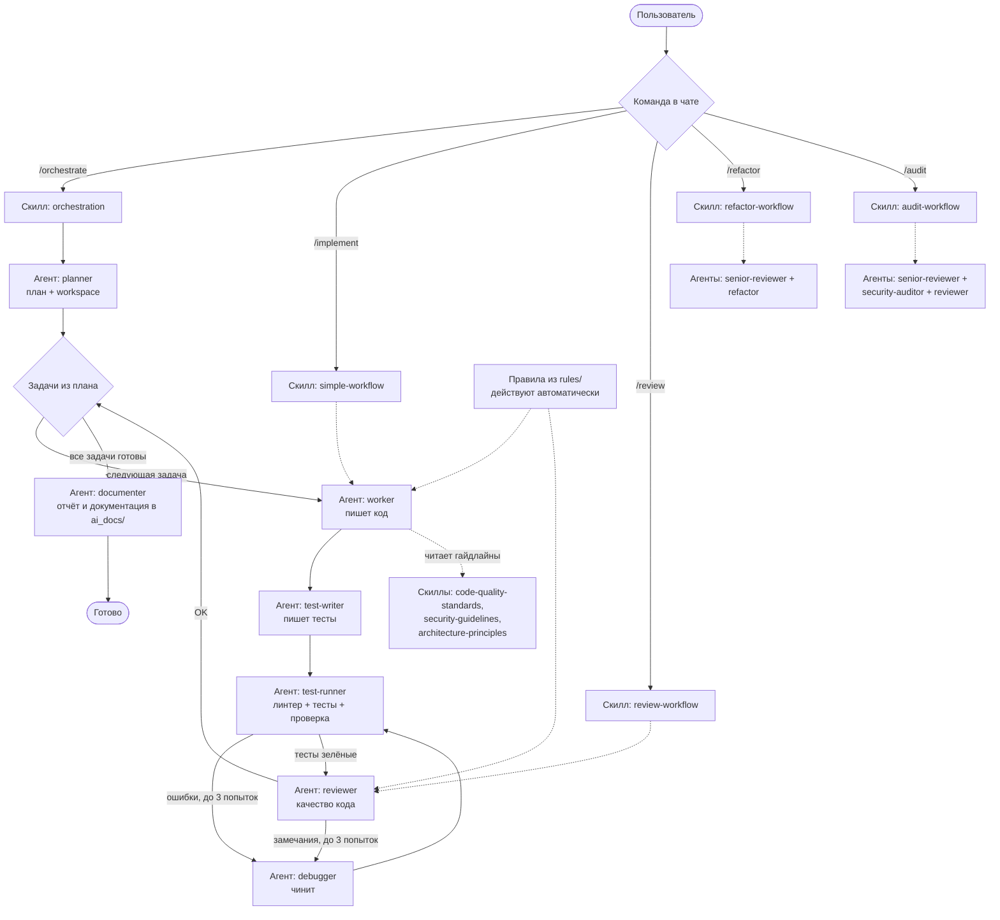

# Cursor Settings Description

Справочник на русском языке, который **зеркально повторяет структуру папки `.cursor/`** и объясняет, что делает каждый файл настроек.

> ⚠️ **Дисклеймер.** Все файлы в этой папке — только **описания** для чтения человеком. Они ничего не запускают и ни на что не влияют. Рабочие настройки лежат в `.cursor/` — редактировать поведение ассистента нужно **только там**. Оригиналы в `.cursor/` при работе над этим справочником не изменяются.

---

## 1. Назначение папки

Эта папка создана на шаге **«Настройка инструментов разработки»** проекта торгового робота **UIS**.

Зачем она нужна:

- **Памятка для себя.** Настройка Cursor состоит из десятков файлов (агенты, команды, правила, скиллы). Через месяц невозможно вспомнить, что за файл `senior-reviewer.md` и когда вызывается команда `/audit`. Здесь каждый файл описан простым языком.
- **Карта системы.** Сущности `.cursor/` связаны между собой: команды вызывают скиллы, скиллы вызывают агентов, агенты читают скиллы-гайдлайны. Справочник показывает эти связи целиком, а не по одному файлу.
- **Точка входа перед изменениями.** Прежде чем править рабочие настройки в `.cursor/`, можно быстро понять из описания, что затронет правка и какие части системы от неё зависят.

Структура папки повторяет `.cursor/` зеркально:

```
Cursor Settings Description/          ← зеркало .cursor/
├── agents/                         ← описания 10 агентов (.cursor/agents/)
├── commands/                       ← описания 5 команд (.cursor/commands/)
├── rules/                          ← описания 5 правил (.cursor/rules/)
├── skills/                         ← описания 11 скиллов (.cursor/skills/)
│   ├── architecture-principles/
│   ├── audit-workflow/
│   ├── code-quality-standards/
│   ├── docs/
│   ├── git-helper/
│   ├── orchestration/
│   ├── refactor-workflow/
│   ├── review-workflow/
│   ├── security-guidelines/
│   ├── simple-workflow/
│   └── task-management/
├── workspace/                      ← описание рабочей области (.cursor/workspace/)
│   └── gitignore.md                ← описание .cursor/workspace/.gitignore
├── config.json.md                  ← описание .cursor/config.json
└── hooks.json.md                   ← описание .cursor/hooks.json
```

---

## 2. Общая карта системы `.cursor/`

В `.cursor/` живут шесть типов сущностей:

| Сущность | Где лежит | Что это |
|----------|-----------|---------|
| **Агенты** | `.cursor/agents/*.md` | Специализированные субагенты с закреплённой ролью (планировщик, кодер, тестировщик и т.д.). Вызываются через инструмент `Task`. |
| **Команды** | `.cursor/commands/*.md` | Слэш-команды (`/orchestrate`, `/implement`, …), которые пользователь вводит в чате. |
| **Правила** | `.cursor/rules/*.md` | Стандарты (git, тесты, безопасность, …), которые ассистент применяет автоматически при работе с кодом. |
| **Скиллы** | `.cursor/skills/*/SKILL.md` | Инструкции двух видов: **воркфлоу** (пошаговые сценарии для команд) и **гайдлайны** (справочники, которые читают агенты перед работой). |
| **config.json** | `.cursor/config.json` | Конфигурация: пути документации `ai_docs/` и настройки workspace. |
| **hooks.json** | `.cursor/hooks.json` | Хуки на события редактора. Сейчас пустые. |

### Как сущности связаны между собой

Система устроена как конвейер «команда → воркфлоу → агенты → гайдлайны»:

1. **Команды вызывают скиллы-воркфлоу.** Каждая команда — тонкая обёртка: она запрещает ассистенту работать самому и велит прочитать конкретный скилл-воркфлоу и исполнить его шаг за шагом. Например, `/orchestrate` читает `skills/orchestration/SKILL.md`.
2. **Скиллы-воркфлоу вызывают агентов.** Воркфлоу — это сценарий вида «вызови planner → worker → test-writer → test-runner → reviewer → documenter», с циклами авто-исправления через debugger (максимум 3 попытки на этап).
3. **Агенты читают скиллы-гайдлайны.** Перед работой каждый агент обязан прочитать справочные скиллы: worker — `code-quality-standards` (всегда), `security-guidelines` (для auth/API/данных), `architecture-principles` (для новых фич); reviewer, planner, security-auditor — свои гайдлайны аналогично.
4. **Правила подключаются автоматически.** Правила из `rules/` никто не вызывает вручную — они подключаются автоматически в релевантном контексте: `testing`, `security` и `documentation` — по маскам файлов (Auto Attached по globs), `git-workflow` и `commit-messages` — по запросу агента (Agent Requested). Постоянно (alwaysApply) не действует ни одно правило.
5. **config.json и workspace обслуживают процесс.** Планировщик создаёт в `.cursor/workspace/active/orch-{id}/` рабочую папку оркестрации с `plan.md`, `progress.json`, `tasks.json`, `links.json`; планы и отчёты сохраняются по путям из `config.json` в `ai_docs/`.

---

## 3. Все разделы системы

### 3.1. Агенты (`.cursor/agents/`) — 10 файлов

Агенты делятся на две группы: **исполнительный конвейер** (участвуют в воркфлоу) и **специалисты по качеству** (вызываются по необходимости).

**Исполнительный конвейер:**

| Агент | Роль одной строкой |
|-------|--------------------|
| `planner` | Планировщик: разбивает сложную задачу на подзадачи, создаёт plan-файл и workspace оркестрации, возвращает ID оркестрации. |
| `worker` | Кодер: пишет код и реализует фичи — единственный, кто выполняет собственно разработку. |
| `test-writer` | Автор тестов: пишет тесты на реализованный код, сам определяет стек и следует конвенциям проекта. |
| `test-runner` | Диагност: гоняет линтер и тесты, проверяет критерии приёмки и **только сообщает** о проблемах (сам ничего не чинит). |
| `debugger` | Хирург: получает отчёты от test-runner и reviewer и **исправляет** баги и недоработки. |
| `documenter` | Документатор: ведёт документацию проекта в `ai_docs/`, создаёт финальные отчёты оркестрации. |

**Специалисты по качеству:**

| Агент | Роль одной строкой |
|-------|--------------------|
| `reviewer` | Ревьюер качества кода: ищет баги, запахи кода, проверяет лучшие практики перед коммитом. |
| `senior-reviewer` | Старший ревьюер: оценивает архитектуру, паттерны и технологические решения при старте фич. |
| `security-auditor` | Аудитор безопасности: проверяет auth, платежи, API-эндпоинты, загрузку файлов, работу с паролями/токенами/PII. |
| `refactor` | Рефакторщик: улучшает структуру кода (сложность, дубли, паттерны), не меняя поведение. |

### 3.2. Команды (`.cursor/commands/`) — 5 команд

| Команда | Что запускает | Когда использовать |
|---------|---------------|--------------------|
| `/orchestrate` | Полный цикл: План → цикл задач (Код → Тест → Ревью) → Документация, через скилл `orchestration`. | Сложные фичи и системы из нескольких модулей, где нужна декомпозиция. |
| `/implement` | Простой воркфлоу: Код → Тест → Документация, через скилл `simple-workflow`. | Одиночные задачи: компонент, функция, эндпоинт — без планирования. |
| `/review` | Воркфлоу ревью: Ревью → (опционально авто-фикс) → Проверка, через скилл `review-workflow`. | Перед коммитом, перед PR, проверка конкретного файла/папки. |
| `/refactor` | Воркфлоу рефакторинга: Анализ → Рефакторинг → Проверка → Документация, через скилл `refactor-workflow`. | Когда качество кода мешает развитию фичи или ревью нашло структурные проблемы. |
| `/audit` | Аудит проекта: Архитектура + Безопасность + Качество кода → сводный отчёт → (опционально) исправления, через скилл `audit-workflow`. | Проверка здоровья проекта перед релизом, онбординг, периодический контроль. |

Важно: каждая команда **запрещает** ассистенту делать работу самому — весь труд выполняют субагенты, команда лишь координирует вызовы по скиллу.

### 3.3. Правила (`.cursor/rules/`) — 5 правил

Правила не нужно вызывать вручную — они подключаются автоматически в релевантном контексте (по маскам файлов или по запросу агента):

| Правило | Что регламентирует |
|---------|--------------------|
| `commit-messages` | Формат Conventional Commits для единообразных сообщений коммитов. |
| `documentation` | Требования к документированию кода и функций. |
| `git-workflow` | Именование веток (`feature/`, `fix/`, `hotfix/`, …), атомарные коммиты, размеры PR, запреты (force push в main, секреты в коммитах). |
| `security` | Критичные правила безопасности, предотвращающие катастрофы. |
| `testing` | Стандарты тестирования и структура тестов. |

### 3.4. Скиллы (`.cursor/skills/`) — 11 скиллов

**Скиллы-воркфлоу** (сценарии, которые исполняют команды):

| Скилл | Назначение |
|-------|------------|
| `orchestration` | Полный цикл разработки: planner → (worker → test-writer → test-runner → reviewer) по каждой задаче → documenter, с авто-исправлением через debugger (до 3 попыток). |
| `simple-workflow` | Упрощённый цикл «код → тест → документация» для простых задач без планирования. |
| `review-workflow` | Ревью кода с опциональным авто-исправлением и финальной проверкой. |
| `refactor-workflow` | Анализ (senior-reviewer) → рефакторинг (refactor) → проверка неизменности поведения (test-runner) → документация. |
| `audit-workflow` | Полный аудит: архитектура, безопасность, качество → консолидированный отчёт с оценкой здоровья проекта → маршрутизация исправлений. |

**Скиллы-гайдлайны** (справочники, которые агенты читают перед работой):

| Скилл | Назначение |
|-------|------------|
| `architecture-principles` | Принципы архитектуры и паттерны проектирования (читают senior-reviewer, planner, worker, reviewer). |
| `code-quality-standards` | Стандарты качества кода: DRY, KISS, YAGNI, запахи кода, чек-листы ревью и рефакторинга. |
| `security-guidelines` | Лучшие практики безопасности для auth, API и чувствительных данных. |
| `task-management` | Система трекинга задач: структура workspace, форматы `progress.json`/`tasks.json`/`links.json`, пути документации. |
| `git-helper` | Помощник по git: генерация сообщений коммитов, ветки, разрешение конфликтов. |
| `docs` | Объясняет структуру проектной документации (`ai_docs/`). |

### 3.5. `config.json` — конфигурация системы

Файл `.cursor/config.json` содержит два блока:

**Блок `workspace`** — настройки рабочих областей оркестрации:

```json
"workspace": {
  "path": ".cursor/workspace",
  "cleanup": {
    "autoCleanCompleted": true,
    "cleanupAfterDays": 7,
    "keepFailed": true
  }
}
```

- `path` — где лежат рабочие папки оркестраций;
- `autoCleanCompleted` — автоматически удалять завершённые оркестрации;
- `cleanupAfterDays` — через сколько дней чистить;
- `keepFailed` — не удалять упавшие оркестрации (чтобы можно было разобраться).

**Блок `documentation`** — пути и переключатели для документации проекта в `ai_docs/`:

```json
"documentation": {
  "paths": {
    "root": "ai_docs",
    "plans": "ai_docs/develop/plans",
    "reports": "ai_docs/develop/reports",
    "issues": "ai_docs/develop/issues",
    "architecture": "ai_docs/develop/architecture",
    ...
  },
  "enabled": { "plans": true, "reports": true, ... }
}
```

- `paths` — куда сохранять планы, отчёты, описание архитектуры, фич, API, компонентов, дизайна, changelog и аудиты;
- `enabled` — какие типы документации включены (все включены). Отключённый тип (`false`) агенты создавать не будут.

### 3.6. `hooks.json` — хуки событий

```json
{
  "version": 1,
  "hooks": {
    "afterFileEdit": [],
    "subagentStop": []
  }
}
```

Зарегистрированы два события (`afterFileEdit` — после правки файла, `subagentStop` — при остановке субагента), но **оба списка пустые** — ни один хук не настроен. Это точка расширения: сюда можно добавить скрипты, например авто-форматирование после правок. Пока хуков нет, события ни к чему не приводят.

### 3.7. `workspace/` — рабочая область оркестраций

`.cursor/workspace/` — временное хранилище состояния запущенных оркестраций:

- `active/orch-{id}/` — идущие оркестрации. Внутри: `plan.md` (план, если задача задана текстом), `progress.json` (статус, счётчики задач), `tasks.json` (статусы задач: `pending` → `in-progress` → `completed`), `links.json` (ссылки на план и отчёт).
- `completed/orch-{id}/` — сюда перемещается папка после финализации (перед автоочисткой по расписанию из `config.json`).

Это служебная зона агентов: сюда они пишут сами, руками туда лезть не нужно.

---

## 4. Схема потока работы

Типовой путь от команды пользователя до готового результата (на примере `/orchestrate` — самого полного воркфлоу):



Ключевые свойства потока:

- **Ассистент-координатор не пишет код сам** — он только вызывает субагентов по сценарию из скилла.
- **Каждая задача проходит ворота качества**: worker → test-writer → test-runner → reviewer. Провал на любом этапе отправляет работу debugger'у (максимум 3 попытки, потом вопрос пользователю).
- **Прогресс персистентен**: статусы задач хранятся в `.cursor/workspace/active/orch-{id}/`, планы и отчёты — в `ai_docs/` по путям из `config.json`.
- **Правила и гайдлайны подключаются сбоку**: правила подключаются автоматически в релевантном контексте, гайдлайны агенты читают перед своим шагом.

---

## 5. Как пользоваться этим справочником

1. Нужно вспомнить, что делает сущность → открой соответствующую папку (`agents/`, `commands/`, `rules/`, `skills/`, `workspace/`) и файл с тем же именем.
2. Хочешь изменить поведение → сначала прочитай описание здесь, потом правь **оригинал в `.cursor/`**.
3. Описание в справочнике расходится с оригиналом → истина всегда в `.cursor/`; обнови описание, чтобы зеркало не устаревало.

---

*Создано на шаге «Настройка инструментов разработки» проекта UIS (торговый робот). Зеркалирует состояние `.cursor/` на 11.08.2026.*
