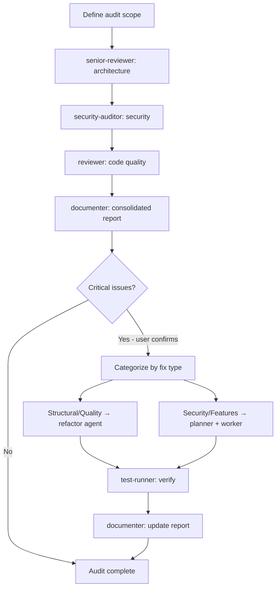

> Оригинал: `.cursor/skills/audit-workflow/SKILL.md`
>
> ⚠️ Это **описание для справки**, а не рабочий скилл. Файл ничего не запускает и ни на что не влияет. Рабочая версия лежит в `.cursor/skills/audit-workflow/SKILL.md` — править поведение нужно только там.

# Скилл `audit-workflow` — полный аудит здоровья проекта

## Назначение и тип

Скилл оркестрирует **полный аудит здоровья проекта**: тремя агентами-аналитиками (senior-reviewer + security-auditor + reviewer) последовательно проверяются архитектура, безопасность и качество кода, результаты агрегируются в сводный отчёт с оценкой здоровья (Health Score), а затем — **только с явного подтверждения пользователя** — критические находки маршрутизируются в подходящие воркфлоу исправления. Всё происходит в одном чате.

**Тип: воркфлоу** (сценарий, который исполняет команда). В отличие от гайдлайнов, этот скилл — пошаговый сценарий: он говорит координатору, каких агентов вызывать, в каком порядке, с каким контекстом и в каком формате собирать результаты.

## Разбор frontmatter

| Поле | Значение | Что означает |
|------|----------|--------------|
| `name` | `audit-workflow` | Имя скилла, совпадает с папкой. |
| `description` | `Full project audit orchestration - Architecture + Security + Code Quality → consolidated report → optional remediation. Use when user invokes /audit command, for pre-release health checks, when onboarding to an unfamiliar codebase, for periodic project quality reviews, or before/after a major architectural change. Covers scope detection, severity aggregation, report format, health scoring, and remediation routing.` | Перечисляет триггеры: команда `/audit`, предрелизные проверки, онбординг на незнакомую кодовую базу, периодический контроль качества, до/после крупных архитектурных изменений. Покрывает: определение скоупа, агрегацию серьёзности, формат отчёта, оценку здоровья, маршрутизацию исправлений. |

## Когда и кем вызывается

- **Командой `/audit`** (`.cursor/commands/`) — основной триггер.
- Поводы: проверка перед релизом; вход в незнакомый проект; периодический контроль; до/после крупного архитектурного изменения.
- Скоуп задаётся аргументом команды (см. Шаг 1 ниже).

## Архитектура воркфлоу (mermaid-диаграмма из оригинала)



Два ключевых правила исполнения:

- **Фазы 1–4 всегда read-only** (только анализ, ничего не меняют). Фаза 5 (исправления) запускается **только с явного подтверждения пользователя**.
- Все аналитические фазы **последовательны** — каждый агент получает контекст предыдущего, чтобы не дублировать находки и углублять анализ.

## Шаг 1: Define Scope (определение скоупа)

Парсинг ввода пользователя:

```
/audit                        → весь проект (src/ или корень проекта)
/audit src/services/          → конкретная директория
/audit src/auth.ts            → один файл (тщательное ревью)
/audit --since main           → только файлы, изменённые относительно ветки main
/audit --since HEAD~10        → последние 10 коммитов
```

Для вариантов `--since` выполняется `git diff --name-only [ref]`, и полученный список файлов передаётся каждому агенту как скоуп. Если скоуп не задан — по умолчанию основной исходный каталог проекта (проверяются `package.json`, `src/`, `app/`; если неоднозначно — спросить пользователя).

## Шаг 2: Architecture Review (агент senior-reviewer)

**Цель**: выявить структурные, дизайнерские и архитектурные проблемы.

Чек-лист: соблюдение SOLID; слоистая архитектура (разделение concerns, направление зависимостей); использование паттернов (корректное, отсутствующее, неправильно применённое); границы модулей и связанность; циклические зависимости; God-классы/модули; масштабируемость (stateful-компоненты, кэширование, узкие места); over-engineering или преждевременная абстракция.

Формат вывода — находки с ID и градацией серьёзности:

```markdown
## Architecture Findings

### Critical
- [A1] Circular dependency: services/user.ts ↔ services/auth.ts

### High
- [A2] God module: utils/helpers.ts (850 lines, mixed concerns)

### Medium
- [A3] Missing repository pattern in services/ — direct DB calls

### Low
- [A4] Strategy pattern opportunity in pricing logic
```

ID архитектурных находок имеют префикс **A** (A1, A2, …).

## Шаг 3: Security Audit (агент security-auditor)

**Цель**: выявить уязвимости и риски безопасности. В контекст передаётся **сводка архитектурных находок** — это помогает аудитору сфокусироваться на зонах высокого риска (auth-сервисы, API-слои).

Чек-лист: потоки аутентификации и авторизации; валидация и санитизация ввода (инъекции, XSS); захардкоженные секреты, токены, креды; покрытие OWASP Top 10; безопасность API-эндпоинтов (rate limiting, CORS, ограничения методов); обращение с чувствительными данными (PII, пароли, токены); уязвимости зависимостей (если доступен `npm audit` или аналог); сообщения ошибок, утекающие внутренние детали.

Формат вывода аналогичен, префикс **S**:

```markdown
## Security Findings

### Critical
- [S1] Hardcoded JWT secret in src/config/auth.ts:12

### High
- [S2] Missing input sanitization on /api/search endpoint

### Medium
- [S3] No rate limiting on /api/auth/login

### Low
- [S4] Missing security headers (CSP, HSTS)
```

## Шаг 4: Code Quality Review (агент reviewer)

**Цель**: выявить проблемы качества кода, поддерживаемости и технический долг. В контекст передаются **сводки архитектуры и безопасности** — чтобы не флаговать уже найденное.

Чек-лист: нарушения DRY (дублированная логика, copy-paste); сложность (функции >30 строк, вложенность >3 уровней); ясность имён; дыры в обработке ошибок (проглоченные ошибки, отсутствие null-проверок); мёртвый код и неиспользуемые импорты; дыры покрытия тестами (критические пути без тестов); TypeScript: `any`, отсутствующие/некорректные типы; комментарии (отсутствуют где нужно, вводящие в заблуждение, устаревшие).

Формат вывода, префикс **Q**:

```markdown
## Code Quality Findings

### High
- [Q1] Duplicate email validation in login.ts:23 and register.ts:31

### Medium
- [Q2] processPayment() is 95 lines with 5 responsibilities
- [Q3] Error swallowed silently in src/utils/api.ts:67

### Low
- [Q4] 12 uses of `any` type in src/types/
```

## Шаг 5: Severity Aggregation (агрегация серьёзности)

Перед передачей documenter'у все находки собираются вместе (псевдокод из оригинала):

```javascript
allFindings = [
  ...architectureFindings,   // A1, A2, ...
  ...securityFindings,        // S1, S2, ...
  ...qualityFindings          // Q1, Q2, ...
]

severity_counts = {
  critical: allFindings.filter(f => f.severity === "Critical").length,
  high:     allFindings.filter(f => f.severity === "High").length,
  medium:   allFindings.filter(f => f.severity === "Medium").length,
  low:      allFindings.filter(f => f.severity === "Low").length
}
```

**Формула Health Score (0–10):** старт с 10; за каждую Critical: −2 (максимум −6); за каждую High: −0.5 (максимум −3); за каждую Medium: −0.1 (максимум −1); Low не штрафуется. Итог ограничен снизу нулём и округляется до 1 знака. (Максимально возможный суммарный штраф — ровно 10: −6 −3 −1.)

## Шаг 6: Consolidated Report (агент documenter)

**Путь отчёта определяется до вызова documenter'а** через `.cursor/config.json` (псевдокод из оригинала):

```javascript
config = readJSON(".cursor/config.json")

auditsEnabled = config.documentation.enabled.audits  // true/false
auditsPath    = config.documentation.paths.audits     // например "ai_docs/develop/audits"

if (auditsEnabled && auditsPath) {
  // Сохранить по сконфигурированному пути документации
  reportFile = `${auditsPath}/YYYY-MM-DD-{scope-slug}-audit.md`
} else {
  // Фолбэк в workspace — аудит всё равно сохраняется, но не в доках проекта
  workspacePath = config.workspace.path  // например ".cursor/workspace"
  reportFile = `${workspacePath}/audits/YYYY-MM-DD-{scope-slug}-audit.md`
}
```

`reportFile` передаётся documenter'у, чтобы он сохранил отчёт в правильное место.

**Формат отчёта** (шаблон из оригинала, сокращённо):

```markdown
# Project Audit Report

**Date**: 2026-02-25
**Scope**: src/services/
**Audited by**: senior-reviewer + security-auditor + reviewer

## Executive Summary

**Overall Health Score**: 7.2/10

| Severity | Architecture | Security | Code Quality | Total |
|----------|-------------|----------|--------------|-------|
| Critical | 1           | 1        | 0            | **2** |
| High     | 2           | 1        | 2            | **5** |
| Medium   | 1           | 1        | 3            | **5** |
| Low      | 1           | 1        | 1            | **3** |

**Recommendation**: Address 2 critical issues before next release.

## Critical Issues (fix immediately)
### [A1] Circular Dependency
**Category**: Architecture
**Location**: services/user.ts ↔ services/auth.ts
**Impact**: Build issues, testing difficulties, runtime errors possible
**Fix**: Extract shared identity logic to services/identity.ts

### [S1] Hardcoded JWT Secret
**Category**: Security
**Location**: src/config/auth.ts:12
**Impact**: Secret exposed in version control — full auth compromise possible
**Fix**: Move to environment variable, rotate immediately

## High Priority Issues (fix soon)
## Medium Priority Issues (plan for next sprint)
## Low Priority / Suggestions

## Priority Matrix
| ID | Issue | Severity | Effort | Priority |
|----|-------|----------|--------|----------|
| S1 | Hardcoded JWT secret | Critical | Low | P0 — now |
| A1 | Circular dependency | Critical | Medium | P0 — now |

## Next Steps
1. **Immediate** (before next commit): [critical fixes]
2. **This sprint**: [high fixes]
3. **Next sprint**: [medium fixes]
4. **Backlog**: [low/suggestions]

Use `/refactor [file]` for structural issues.
Use `/implement [fix]` for feature-level security fixes.
```

Каждая критическая находка в отчёте раскрывается блоком: Category / Location / Impact / Fix.

## Audit Scope Guide — глубина аудита по скоупу

| Scope | Depth | Typical duration |
|-------|-------|-----------------|
| Single file | Very thorough | Fast |
| Single module (5-10 files) | Thorough | Normal |
| Large directory (20-50 files) | Balanced | Longer |
| Full project | High-level + deep on critical areas | Long |

Для аудита больших проектов: каждый агент фокусируется на **самых критичных 20–30% файлов** (ядро бизнес-логики, auth, API-слой), а не на конфигах, сгенерированном коде или тестах.

## Phase 5: Remediation Routing (маршрутизация исправлений)

Запускается **только если**: 1) в фазах 1–3 найдены критические проблемы; 2) пользователь явно подтвердил на вопрос («Start remediation? y/n»).

### Как спрашивать пользователя

После показа отчёта выводится сводка вида:

```
Audit complete. Health Score: X/10

Critical issues requiring immediate attention:
- [A1] Circular dependency: services/user.ts ↔ services/auth.ts  (structural)
- [S1] Hardcoded JWT secret in src/config/auth.ts:12             (security)

Start remediation for these critical issues? (y/n)
If yes, fixes will be applied in this chat automatically.
```

**Дождаться ответа пользователя, прежде чем что-либо делать.**

### Категоризация находок на два бакета

**Bucket A — Structural / Code Quality** (чинит агент `refactor`): циклические зависимости; God-классы/модули; глубокая вложенность / длинные функции; нарушения DRY; нарушения SOLID; сложность / запахи кода.

**Bucket B — Security / Behavioral** (чинят `planner` + `worker`): захардкоженные секреты/креды; отсутствующая валидация/санитизация ввода; дыры в auth/authz; отсутствующий rate limiting; любой фикс, требующий **добавления новой логики**, а не просто переструктурирования.

### Исполнение Bucket A (через refactor)

```javascript
Task(
  subagent_type="refactor",
  prompt="Fix the following structural issues found during audit:
  [list each finding with file path and description]

  Context: these were identified by senior-reviewer during a full audit.
  Rules: no behavior changes, all existing tests must pass after refactoring."
)
```

Затем проверка через `test-runner` («Verify refactoring did not break anything. Files changed: [from refactor agent]»). Если тесты падают → `debugger` → повтор test-runner (максимум 3 попытки).

### Исполнение Bucket B (через planner + worker)

Сначала `planner` создаёт план ремедиации (каждая проблема — одна задача, задачи маленькие и независимые). Затем для каждой задачи стандартный цикл:

```
Task(subagent_type="worker", ...)
Task(subagent_type="test-writer", ...)       ← тесты на фикс
Task(subagent_type="test-runner", ...)
  → при провале: Task(subagent_type="debugger") → retry (максимум 3)
Task(subagent_type="security-auditor", ...)  ← проверка конкретного фикса
  → при проблемах: Task(subagent_type="debugger") → retry (максимум 3)
```

### После применения всех фиксов

`documenter` обновляет отчёт аудита — добавляет секцию «## Remediation Applied» с датой, списком «### Fixed» (что исправлено и как, например «[A1] Circular dependency → resolved by extracting services/identity.ts») и списком «### Remaining (High/Medium/Low — not auto-fixed)».

### Remediation Decision Matrix

| Finding Type | Bucket | Agent |
|-------------|--------|-------|
| Circular dependency | A | refactor |
| God class / long function | A | refactor |
| Code duplication | A | refactor |
| Deep nesting | A | refactor |
| Hardcoded secret | B | planner + worker |
| Missing validation | B | planner + worker |
| Auth/authz gap | B | planner + worker |
| Missing rate limiting | B | planner + worker |
| Missing security headers | B | planner + worker |

## What Audit Does NOT Auto-Fix — что аудит НЕ чинит автоматически

- Проблемы High / Medium / Low (только репортятся).
- Проблемы, требующие большого архитектурного редизайна (сначала обсуждение с пользователем).
- Проблемы в стороннем/vendor-коде.

Для оставшихся проблем пользователь может: запустить `/refactor [file]` на конкретных структурных проблемах или `/orchestrate` для большого плана ремедиации.

## Связи с другими файлами

- **Запускается командой**: `/audit` (`.cursor/commands/`).
- **Вызывает агентов**: `senior-reviewer` (архитектура) → `security-auditor` (безопасность) → `reviewer` (качество) → `documenter` (отчёт); в фазе ремедиации — `refactor`, `planner`, `worker`, `test-writer`, `test-runner`, `debugger`, повторный `security-auditor`, снова `documenter`.
- **Читает конфигурацию**: `.cursor/config.json` (блоки `documentation.paths.audits` / `documentation.enabled.audits` и `workspace.path`) — путь отчёта жёстко не зашит.
- **Пишет**: отчёт аудита в `ai_docs/develop/audits/YYYY-MM-DD-{scope-slug}-audit.md` (или фолбэк `.cursor/workspace/audits/…`).
- **Ссылается на другие команды/воркфлоу**: `/refactor` (структурные исправления), `/implement` (фиксы уровня фичи), `/orchestrate` (большой план ремедиации).
- **Гайдлайны, которые читают вызванные агенты**: `architecture-principles` (senior-reviewer), `security-guidelines` (security-auditor), `code-quality-standards` (reviewer, refactor, worker, debugger) — чек-листы аудита по сути являются экзаменом по этим трём справочникам.
