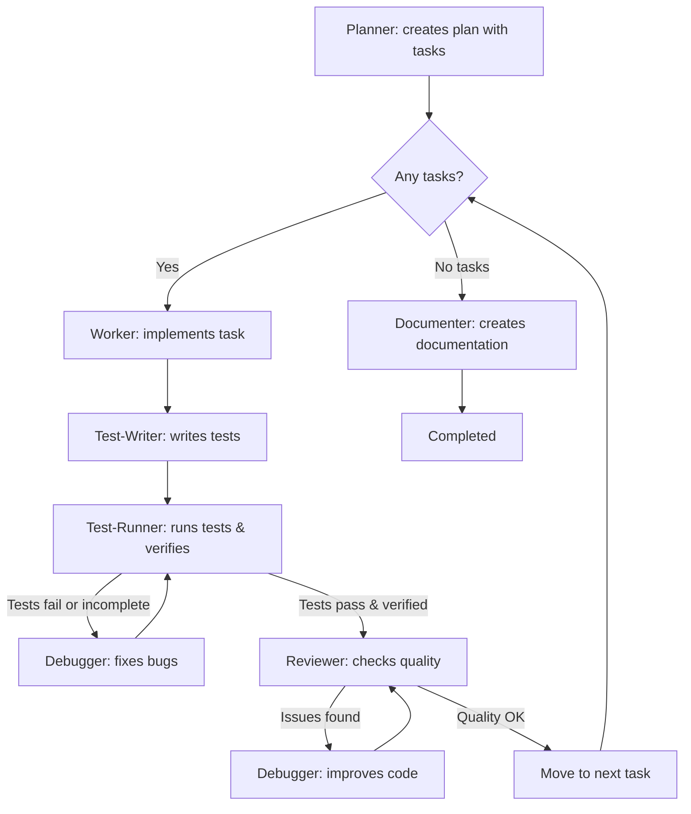

> Оригинал: `.cursor/skills/orchestration/SKILL.md`
>
> ⚠️ Это **описание для справки**, а не рабочий скилл. Файл ничего не запускает и ни на что не влияет. Рабочая версия лежит в `.cursor/skills/orchestration/SKILL.md` — править поведение нужно только там.

# Скилл `orchestration` — полный цикл разработки

## Назначение и тип

Скилл оркестрирует **полный цикл разработки** — от планирования до документации с автоматическим исправлением ошибок: planner разбивает задачу, затем каждая подзадача проходит ворота «worker → test-writer → test-runner → reviewer» с авто-исправлением через debugger (до 3 попыток на этап), а в конце documenter создаёт финальный отчёт. Это **самый главный и самый полный воркфлоу системы**.

**Тип: воркфлоу** (сценарий, который исполняет команда). Координатор (основной ассистент) исполняет скрипт пошагово: вызывает субагентов последовательно, передаёт контекст, обновляет статусы в workspace. Сам координатор код не пишет.

## Разбор frontmatter

| Поле | Значение | Что означает |
|------|----------|--------------|
| `name` | `orchestration` | Имя скилла, совпадает с папкой. |
| `description` | `Full implementation cycle with planning, testing, review, and auto-fixing. Use when user invokes /orchestrate, for complex tasks requiring planning and breakdown, multi-step implementations, or tasks that need thorough testing and review.` | Триггеры: команда `/orchestrate`, сложные задачи с декомпозицией, многошаговые реализации, задачи, требующие тщательного тестирования и ревью. |

## Когда и кем вызывается

- **Командой `/orchestrate [task]`** (`.cursor/commands/`).
- **Триггерные фразы**: «Orchestrate [X]», «Full implementation of [Y]».
- **Подходящие задачи**: система аутентификации; админ-дашборд с CRUD; интеграция платежей; миграция схемы БД; рефакторинг крупного модуля с тестами.
- **Неподходящие** (для них `/implement` и скилл `simple-workflow`): добавить одну функцию; исправить простой баг; создать один компонент; обновить один файл.

Сравнительная таблица из оригинала:

| Use `/implement` | Use `/orchestrate` |
|-----------------|---------------------|
| Single component | Full feature |
| One file change | Multiple modules |
| No planning needed | Needs breakdown |
| Quick task | Complex project |

## Архитектура воркфлоу (mermaid-диаграмма из оригинала)



## Phase 1: Planning (планирование)

1. Вызвать **planner** с полным описанием задачи.
2. Planner создаёт: workspace `.cursor/workspace/active/orch-{id}/`; файл плана `plan.md` (или использует файл пользователя); метаданные `progress.json`, `tasks.json`, `links.json`.
3. Planner возвращает **ID оркестрации**.

## Phase 2: Load Orchestration (загрузка оркестрации)

Чтение конфигурации и состояния (псевдокод из оригинала):

```javascript
config = readJSON(".cursor/config.json") || defaultConfig
workspacePath = config.workspace.path

orchestrationId = userInput || findLatestActive()
workspaceDir = `${workspacePath}/active/${orchestrationId}`

progress = readJSON(`${workspaceDir}/progress.json`)
tasksState = readJSON(`${workspaceDir}/tasks.json`)
links = readJSON(`${workspaceDir}/links.json`)

// План читается из документации
planContent = read(links.plan)
taskIds = extractTaskIds(planContent)
```

Если пользователь не указал ID — берётся последняя активная оркестрация (`findLatestActive()`), что позволяет продолжить прерванную работу.

## Phase 3: Task Loop (цикл по задачам)

**CRITICAL (прямая пометка оригинала):** пройти по ВСЕМ задачам.

**Перед стартом задачи** (псевдокод из оригинала):

```javascript
// Пропустить уже завершённые
if (tasksState[taskId]?.status === "completed") continue

// Статус задачи: pending → in-progress
tasksState[taskId] = {
  id: taskId,
  status: "in-progress",
  startedAt: now()
}
write(`${workspaceDir}/tasks.json`, tasksState)

// Обновить файл плана
updateTaskInPlan(links.plan, taskId, "🔄 In Progress")

// Обновить прогресс оркестрации
updateJSON(`${workspaceDir}/progress.json`, {
  currentTask: taskId,
  lastUpdated: now()
})
```

**Во время задачи — 5 шагов:**

1. **Implementation** — вызвать **worker** с текущей подзадачей; дождаться завершения; извлечь, что было создано. *(В оригинале здесь пометка «Hook auto-fixes formatting in background».)* *Примечание: в оригинале хук упоминается, но в текущем hooks.json он не настроен — см. ../../hooks.json.md*
2. **Test Creation** — вызвать **test-writer**: пишет исчерпывающие тесты на реализованный код; сам определяет стек и следует тестовым конвенциям проекта; дождаться завершения; извлечь созданные тестовые файлы.
3. **Linting + Testing + Verification** — вызвать **test-runner**: проверяет линтер (качество, стиль), тесты (функциональность) и верификацию (критерии приёмки, полнота реализации). **Если тесты падают или верификация неполна** → вызвать **debugger** (чинит или достраивает недостающее) → повторно test-runner. Максимум **3 попытки**.
4. **Code Review** — вызвать **reviewer** для проверки качества. **Если находит проблемы** → **debugger** улучшает код → повторно reviewer. Максимум **3 попытки**.
5. **Update Task Status** — после верификации test-runner'ом и одобрения reviewer'ом (псевдокод из оригинала):

```javascript
// Статус задачи: in-progress → completed
tasksState[taskId] = {
  ...tasksState[taskId],
  status: "completed",
  completedAt: now(),
  filesChanged: result.filesChanged,
  testsRun: testResult.total,
  testsPassed: testResult.passed
}
write(`${workspaceDir}/tasks.json`, tasksState)

// Обновить файл плана
updateTaskInPlan(links.plan, taskId, "✅ Completed")

// Обновить прогресс оркестрации
updateJSON(`${workspaceDir}/progress.json`, {
  tasksCompleted: progress.tasksCompleted + 1,
  currentTask: null,
  lastUpdated: now()
})
```

## Phase 4: Finalization (финализация)

После завершения всех задач (псевдокод из оригинала):

```javascript
// Статус оркестрации → "documenting"
updateJSON(`${workspaceDir}/progress.json`, {
  status: "documenting",
  lastUpdated: now()
})

// Вызвать documenter для финального отчёта
reportFile = callDocumenter({
  orchestrationId: progress.id,
  planFile: links.plan,
  tasksState: tasksState
})

// Сохранить ссылку на отчёт
updateJSON(`${workspaceDir}/links.json`, {
  report: reportFile
})

// Отметить оркестрацию завершённой
updateJSON(`${workspaceDir}/progress.json`, {
  status: "completed",
  completedAt: now(),
  reportFile: reportFile
})

// Архивировать workspace
move(
  `${workspacePath}/active/${orchestrationId}`,
  `${workspacePath}/completed/${orchestrationId}`
)
```

## Important Rules — важные правила

- **Sequential Execution**: дожидаться завершения каждого агента перед вызовом следующего; передавать контекст от предыдущего агента следующему; отслеживать состояние на протяжении всего воркфлоу.
- **Error Handling**: автоматический retry с debugger'ом при провалах; **максимум 3 попытки на этап** (test/review); при исчерпании попыток — отчитаться пользователю и спросить, что делать.
- **Task Limits**: рекомендуемый максимум — **10 задач на цикл оркестрации**; если planner создал больше 10 — выполнить первые 10, отчитаться и спросить, продолжать ли остальные. При приближении к лимиту контекстного окна — сохранить прогресс и спросить пользователя.
- **Task Tracking**: отслеживать завершённые и ожидающие задачи; показывать прогресс после каждой задачи (например, «Task 3/7»); показывать оценку оставшихся задач; финальная сводка перечисляет всю проделанную работу.
- **Context Management**: каждый агент получает контекст о том, что делали предыдущие; debugger получает конкретные детали ошибок; documenter получает полную картину всех изменений.

## Example Usage — пример использования

Запрос: `/orchestrate Build user authentication with email/password and OAuth`. Ответ координатора (структура из оригинала):

```markdown
**Task**: Build user authentication with email/password and OAuth

### Phase 1: Planning
[Call planner to break down into subtasks]

**Plan created:**
1. Database schema for users
2. Email/password authentication
3. OAuth integration (Google, GitHub)
4. Session management
5. Protected routes middleware

### Phase 2: Implementation Cycle

**Task 1/5: Database schema for users**
- [Call worker to implement]
- [Call test-writer to create tests]
- [Call test-runner for tests & verification]
- [If failed: call debugger and retry]
- [Call reviewer]
- [If issues: call debugger and retry]
- ✅ Task 1 complete

**Task 2/5: Email/password authentication**
...

### Phase 3: Documentation
[Call documenter with all changes]

### Summary
✅ All 5 tasks completed
✅ Tests passing
✅ Code reviewed
✅ Documentation created
```

## Retry Logic — логика повторов

Два цикла авто-исправления, оба с лимитом 3 попытки:

```
test-runner → FAIL → debugger → test-runner
  ↓ (max 3 attempts)
  ↓
  Если всё ещё падает: отчитаться пользователю

review → PROBLEMS → debugger → review
  ↓ (max 3 attempts)
  ↓
  Если всё ещё есть проблемы: отчитаться пользователю
```

## Key Features — ключевые возможности (6 пунктов)

1. **Automatic Planning** — разбивает сложные задачи на управляемые части.
2. **Test Writing** — test-writer создаёт тесты для каждой реализованной задачи (авто-определение стека).
3. **Auto-fixing** — debugger автоматически исправляет провалы тестов/ревью.
4. **Quality Gates** — каждая задача проходит test-writer → test-runner (с верификацией) → reviewer.
5. **Progress Tracking** — видно, какие задачи выполнены, какие ожидают.
6. **Comprehensive Docs** — полная документация по завершении всей работы.

## Success Criteria — критерии успеха

Воркфлоу считается завершённым, когда: ✅ все запланированные задачи реализованы; ✅ все тесты проходят; ✅ код-ревью одобрено; ✅ все критерии приёмки проверены (test-runner'ом); ✅ документация создана.

## Notes — заметки (5 пунктов)

- Этот скилл заменяет оркестрацию на базе хуков (hook-based orchestration).
- Всё исполнение происходит в одном чате и видно пользователю.
- Пользователь может вмешаться в любой момент.
- Debugger вызывается только при реальных ошибках/проблемах.
- Лимит в 3 попытки предотвращает бесконечные циклы.

## Связи с другими файлами

- **Запускается командой**: `/orchestrate` (`.cursor/commands/`).
- **Вызывает агентов** (полный исполнительный конвейер): `planner` → по каждой задаче `worker` → `test-writer` → `test-runner` (→ `debugger` при провалах) → `reviewer` (→ `debugger` при замечаниях) → в конце `documenter`.
- **Читает конфигурацию**: `.cursor/config.json` (блок `workspace.path`).
- **Пишет состояние**: `.cursor/workspace/active/orch-{id}/` — `plan.md`, `progress.json`, `tasks.json`, `links.json` (форматы описаны в скилле `task-management`); по завершении папка перемещается в `.cursor/workspace/completed/orch-{id}/`.
- **Отчёт и план**: сохраняются в `ai_docs/` по путям из `config.json` (правила структуры — в скилле `docs`).
- **Альтернатива**: скилл `simple-workflow` (команда `/implement`) — для простых задач без планирования; выбор между ними описан в сравнительной таблице выше.
- **Гайдлайны, которые читают вызванные агенты**: worker — `code-quality-standards` (+ условно `security-guidelines`, `architecture-principles`); reviewer — `code-quality-standards`; debugger — `code-quality-standards`.
- **Хуки**: шаг Implementation упоминает фоновый хук авто-форматирования. *Примечание: в оригинале хук упоминается, но в текущем hooks.json он не настроен — см. ../../hooks.json.md*
