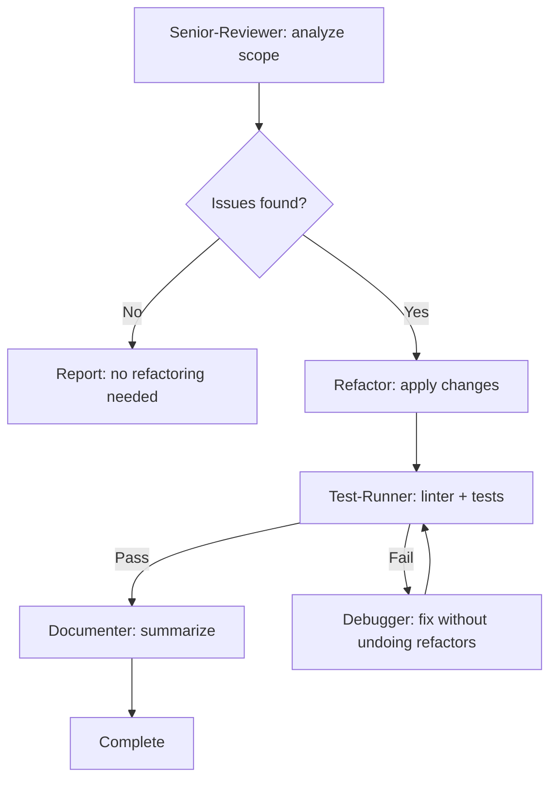

> Оригинал: `.cursor/skills/refactor-workflow/SKILL.md`
>
> ⚠️ Это **описание для справки**, а не рабочий скилл. Файл ничего не запускает и ни на что не влияет. Рабочая версия лежит в `.cursor/skills/refactor-workflow/SKILL.md` — править поведение нужно только там.

# Скилл `refactor-workflow` — безопасный цикл рефакторинга

## Назначение и тип

Скилл оркестрирует **безопасный, проверенный тестами цикл рефакторинга** по цепочке агентов: senior-reviewer (анализ) → refactor (изменения) → test-runner (проверка) → documenter (итоговый отчёт), с авто-исправлением через debugger при падениях тестов. Ключевая идея — рефакторить только код, покрытый тестами, и никогда не менять поведение.

**Тип: воркфлоу** (сценарий, который исполняет команда). Координатор (основной ассистент) вызывает субагентов последовательно и передаёт контекст; сам код не пишет.

## Разбор frontmatter

| Поле | Значение | Что означает |
|------|----------|--------------|
| `name` | `refactor-workflow` | Имя скилла, совпадает с папкой. |
| `description` | `Refactor workflow orchestration - Analyze → Refactor → Verify → Docs. Use when user invokes /refactor command, when code review or senior-reviewer identifies structural problems, when code quality is blocking a new feature, or after adding test coverage to a previously untested module. Covers scoping, agent sequencing, retry logic, and output format.` | Триггеры: команда `/refactor`; ревью или senior-reviewer нашли структурные проблемы; низкое качество кода блокирует новую фичу; тесты только что добавлены на ранее непокрытый модуль. |

## Когда и кем вызывается

- **Командой `/refactor [scope]`** (`.cursor/commands/`).
- **Ситуации**: ревью выявило «запахи» кода; качество мешает разработке фичи; модуль наконец-то покрыт тестами и его можно безопасно чистить.
- **Кем исполняется**: основной ассистент-координатор, который вызывает субагентов senior-reviewer, refactor, test-runner, debugger, documenter.

## Архитектура воркфлоу (mermaid-диаграмма из оригинала)



**Максимум повторов**: 3 на этап. Если превышен — пауза и отчёт пользователю.

## Step 1: Define Scope (определение области)

До вызова любого агента из входных данных извлекается область рефакторинга:

```
/refactor src/utils/helpers.ts              → один файл
/refactor src/services/                     → директория
/refactor "Extract auth logic from UserService" → по намерению (intent-based)
/refactor                                   → недавние git-изменения (git diff)
```

Если область неясна — спросить пользователя: файлы, директория или цель.

## Step 2: Pre-condition Check — обязательное наличие тестов

**CRITICAL (прямая пометка оригинала):** перед рефакторингом проверить, что целевой код покрыт тестами.

```
Если тестов для цели нет:
  → Предупредить пользователя: «No tests found for [scope]. Refactoring without tests is risky.
     Recommend: run /implement to add tests first, then /refactor.»
  → Спросить: «Continue anyway? (risky) or add tests first?»
  → Если пользователь говорит продолжать: действовать с повышенной осторожностью, без изменений поведения
```

## Step 3: Analysis Phase (анализ, агент senior-reviewer)

Вызвать senior-reviewer с явной инструкцией **только анализировать, не исправлять**.

**Что запросить:**
- Запахи кода с локацией (файл + примерный диапазон строк).
- Конкретный рекомендуемый тип рефакторинга для каждого запаха.
- Приоритет: High / Medium / Low.
- Зависимости: какие запахи блокируют другие.

**Категории запахов из оригинала (таблица):**

| Запах | Как выглядит | Рефакторинг |
|-------|--------------|-------------|
| Long function | >30 строк, несколько обязанностей | Extract Function |
| God class | >300 строк, делает всё | Extract Class |
| Duplicate code | Одинаковая логика в 2+ местах | Extract + Reuse |
| Deep nesting | >3 уровней if/for | Guard Clauses, Early Return |
| Feature envy | Класс чрезмерно использует данные другого класса | Move Method |
| Data clump | Одни и те же 3+ параметра повторяются вместе | Extract Object |
| Primitive obsession | Строки/числа вместо типов | Value Objects |
| Switch on type | Длинный if/switch по строковому типу | Polymorphism / Strategy |
| Shotgun surgery | Одно изменение требует правок во многих файлах | Move + Consolidate |

**Ожидаемый вывод senior-reviewer (формат из оригинала):**

```markdown
## Refactoring Analysis

### Target 1 — [High] Long function
File: src/services/auth.ts, lines 45-120
Smell: processLogin() does validation, DB lookup, token creation, and logging
Recommended: Extract Function × 3

### Target 2 — [Medium] Duplicate validation
Files: src/api/login.ts:23, src/api/register.ts:31
Smell: Same email + password validation repeated
Recommended: Extract to src/utils/validation.ts
```

## Step 4: Refactoring Phase (агент refactor)

Передать refactor-агенту полный вывод анализа.

**Ключевые инструкции:**
- Полный список целей от senior-reviewer.
- Исходная область/файлы.
- «Apply refactorings in priority order» (применять в порядке приоритета).
- «Stop and report if any refactoring would require behavior change» (остановиться и отчитаться, если потребуется изменение поведения).
- «Do NOT add new features, new tests, or change public interfaces» (не добавлять фичи, тесты, не менять публичные интерфейсы).

**Что делает refactor-агент:**
1. Читает скилл `code-quality-standards`.
2. Применяет каждый рефакторинг маленькими шагами.
3. После каждого шага проверяет, что код компилируется / нет явных поломок.
4. Отчитывается в формате «до/после» по каждому изменению.

## Step 5: Verification Phase (проверка, агент test-runner)

После завершения рефакторинга убедиться, что ничего не сломалось.

**Что запросить у test-runner:**
- Прогнать линтер по всем изменённым файлам.
- Прогнать весь набор тестов (или только связанные с изменёнными файлами, если так быстрее).
- Подтвердить: нет новых падений по сравнению с состоянием до рефакторинга.

**Если тесты падают:**

```
→ Вызвать debugger с:
  - Какой тест упал
  - Какой рефакторинг это вызвал
  - Ограничение: "Fix the test failure WITHOUT undoing the refactoring.
    The refactoring was correct — there may be an import path change,
    a renamed symbol, or a moved function that tests need to update."
    (чинить падение, НЕ отменяя рефакторинг: дело может быть в путях импорта,
    переименованных символах или перемещённых функциях, которые нужно обновить в тестах)
→ Повторно test-runner
→ Максимум 3 попытки
→ Если всё ещё падает после 3: пауза, полный отчёт пользователю
```

## Step 6: Documentation Phase (документирование, агент documenter)

После успешной проверки задокументировать сессию.

**Что должен выдать documenter (формат из оригинала):**

```markdown
## Refactoring Report

**Date**: 2026-02-25
**Scope**: src/services/auth.ts
**Triggered by**: /refactor command

### Changes Applied

1. Extracted validateCredentials() from processLogin()
   - Before: 1 function, 85 lines
   - After: 3 functions, avg 28 lines each

2. Moved duplicate email validation to src/utils/validation.ts
   - Files updated: src/api/login.ts, src/api/register.ts, src/utils/validation.ts

### Metrics
- Functions extracted: 3
- Duplicate code removed: ~40 lines
- Files changed: 4
- Tests: 12/12 passing (no regressions)

### Remaining Issues (not addressed)
- [запахи, отмеченные senior-reviewer, но вышедшие за рамки области]
```

## Retry Logic — логика повторов

```
test-runner FAIL → debugger (чинит импорты/символы, не логику) → test-runner
  Max 3 attempts
  Если всё ещё падает: отчитаться пользователю с деталями:
    - Что было отрефакторено
    - Какой тест падает
    - Что пытался сделать debugger
    - Спросить: откатить именно этот рефакторинг? или разбираться вручную?
```

## Refactor vs Rewrite Decision — рефакторить или переписывать

| Сигнал | Рекомендация |
|--------|--------------|
| Код сложный, но тесты проходят | Refactor (безопасно) |
| У кода нет тестов | Сначала добавить тесты через /implement |
| Логика неверна И код грязный | Сначала чинить баги (/implement), потом рефакторить |
| Модулю нужен совершенно другой дизайн | Обсудить с пользователем — возможно, нужен /orchestrate |
| Меняется публичный API | Это НЕ рефакторинг — использовать /orchestrate |

## Scope Sizing — размер области

Каждая сессия рефакторинга должна быть сфокусированной:

| Область | Макс. файлов | Рекомендация |
|---------|--------------|--------------|
| Одна функция | 1 | ✅ Идеально |
| Один файл | 1 | ✅ Отлично |
| Один модуль/директория | 3-5 | ✅ Нормально |
| Несколько модулей | 6-10 | ⚠️ Разбить на сессии |
| Вся кодовая база | >10 | ❌ Слишком много — сузить область |

Крупные рефакторинги разбиваются на несколько сессий `/refactor`, каждая — по одному модулю или аспекту.

## Связи с другими файлами

- **Запускается командой**: `/refactor` (`.cursor/commands/`).
- **Вызывает агентов**: `senior-reviewer` (только анализ) → `refactor` (изменения) → `test-runner` (линтер + тесты) → `debugger` (при падениях, без отмены рефакторинга) → `documenter` (отчёт).
- **Гайдлайн, который читает refactor-агент**: `code-quality-standards`.
- **Смежные команды**: `/implement` (сначала тесты на непокрытый код; исправление багов), `/orchestrate` (смена дизайна или публичного API — выходит за рамки рефакторинга), `/review` (может выявить проблемы, ставшие поводом для рефакторинга).
- **Отчёт**: documenter пишет по правилам структуры документации (скилл `docs`, пути из `.cursor/config.json`).
