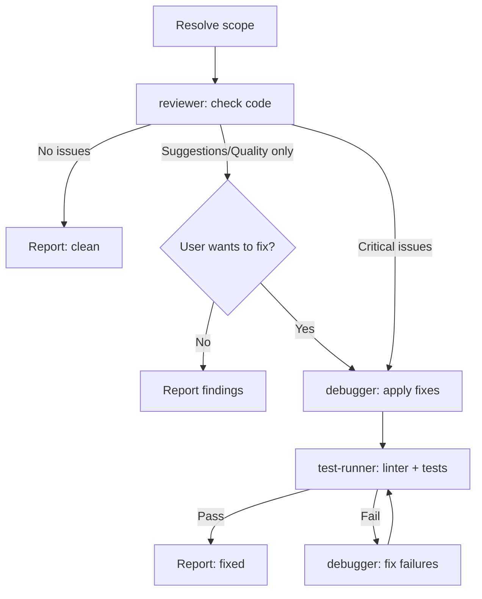

> Оригинал: `.cursor/skills/review-workflow/SKILL.md`
>
> ⚠️ Это **описание для справки**, а не рабочий скилл. Файл ничего не запускает и ни на что не влияет. Рабочая версия лежит в `.cursor/skills/review-workflow/SKILL.md` — править поведение нужно только там.

# Скилл `review-workflow` — целевое ревью кода

## Назначение и тип

Скилл оркестрирует **точечное ревью кода** по цепочке: reviewer (проверка) → опционально debugger (авто-исправление) → test-runner (верификация). В отличие от полного аудита, это быстрый воркфлоу «проверить → при желании починить → убедиться, что ничего не сломалось».

**Тип: воркфлоу** (сценарий, который исполняет команда). Координатор (основной ассистент) вызывает субагентов через Task tool; сам код не пишет и файлы не редактирует.

## Разбор frontmatter

| Поле | Значение | Что означает |
|------|----------|--------------|
| `name` | `review-workflow` | Имя скилла, совпадает с папкой. |
| `description` | `Code review workflow - Review → (optional auto-fix) → Verify. Use when user invokes /review command, before committing, after finishing a feature and before creating a PR, or for a quick sanity check on a specific file or directory.` | Триггеры: команда `/review`; перед коммитом; после завершения фичи и перед созданием PR; быстрая проверка конкретного файла или директории. |

## Когда и кем вызывается

- **Командой `/review [scope]`** (`.cursor/commands/`).
- **Ситуации**: pre-commit проверка; проверка фичи перед PR; отдельное исправление того, что reviewer нашёл внутри `/orchestrate`; быстрая проверка одного файла.
- **Кем исполняется**: основной ассистент-координатор; каждый шаг — обязательный вызов субагента через Task tool.

## Архитектура воркфлоу (mermaid-диаграмма из оригинала)



## Step 0 — Resolve Scope (определение области)

```
/review                     # staged-изменения (pre-commit)
/review src/components/     # конкретная директория
/review src/auth.ts         # один файл
/review --staged            # явно только staged-изменения
/review --last-commit       # изменения последнего коммита
```

Логика по умолчанию: если область не задана — **staged changes** (`git diff --staged`); если ничего не добавлено в staging — **recent changes** (`git diff HEAD`); если и там пусто — спросить пользователя, какие файлы проверять.

## Step 1 — Code Review (агент reviewer)

**REQUIRED (прямая пометка оригинала): вызвать Task tool с `subagent_type="reviewer"`** (пример из оригинала):

```
Task(
  subagent_type="reviewer",
  prompt="Review the following: [scope/files/staged changes].
  Check for: bugs, security issues, DRY violations, SOLID violations,
  complexity, naming, error handling, TypeScript issues.
  Categorize findings as Critical / Quality / Suggestion.
  Include specific file paths and line numbers."
)
```

Дождаться завершения. Извлечь находки по категориям.

**Ветвление по результату:**
- **Проблем нет** → отчитаться ✅ пользователю и остановиться.
- **Только Suggestions/Quality (некритичные)** → показать находки и спросить: «Fix these now?» → переход к Step 2; «Just report» → стоп, дальше ничего.
- **Есть Critical** → всегда переходить к Step 2 (если область большая — сначала спросить пользователя).

## Step 2 — Auto-Fix (условный шаг, агент debugger)

**Запускается только если**: найдены критические проблемы ИЛИ пользователь согласился чинить quality-замечания.

**REQUIRED: вызвать Task tool с `subagent_type="debugger"`** (пример из оригинала):

```
Task(
  subagent_type="debugger",
  prompt="Fix the following code review issues:

  Critical issues: [list from Step 1]
  Quality issues (if user approved): [list from Step 1]

  Files: [list of files]

  Fix each issue. Do NOT refactor beyond what's needed to fix the reported problems.
  Do NOT add new features."
)
```

Дождаться завершения. Извлечь, что было исправлено. Ключевое ограничение: чинить только отчитанные проблемы, без лишнего рефакторинга и новых фич.

## Step 3 — Verification (условный шаг, агент test-runner)

**Запускается только если выполнялся Step 2** (были применены исправления).

**REQUIRED: вызвать Task tool с `subagent_type="test-runner"`** (пример из оригинала):

```
Task(
  subagent_type="test-runner",
  prompt="Verify fixes did not break anything.
  Files changed: [list from Step 2]
  Fixes applied: [summary from Step 2]

  Run: linter + tests."
)
```

- Если тесты падают → **REQUIRED: Task(subagent_type="debugger")** с деталями ошибок → повторный test-runner.
- Максимум **3 попытки**. Если всё ещё падает — отчитаться пользователю.

## Important Rules — важные правила (5 пунктов)

1. **DO NOT write any code yourself** — координатор не пишет код.
2. **DO NOT edit any files yourself** — все изменения происходят только через субагентов.
3. **EVERY step MUST use the `Task` tool** с правильным `subagent_type`.
4. **Always ask before fixing** некритичных (quality/suggestion) проблем.
5. **Pass context forward** — каждому агенту передавать, что нашёл/сделал предыдущий.

## Progress Reporting — отчёты о прогрессе

После каждого вызова субагента сообщать пользователю:
- Что проверялось (файлы/область).
- Разбивку находок (critical / quality / suggestions).
- Были ли применены исправления.
- Финальный статус: ✅ clean / ⚠️ issues remaining / ❌ failures.

## Example Progress Output — пример вывода (из оригинала)

```
**Reviewing: staged changes (3 files)**
→ reviewer: ⚠️ Issues found
  - 🔴 1 critical: null pointer in user.ts:45
  - 🟡 2 quality: DRY violation, magic number
  - 🟢 1 suggestion: memoization opportunity

→ debugger: ✅ Fixed critical + quality issues
→ test-runner: ✅ All passing

Summary: 3 issues fixed. 1 suggestion left for later.
```

## When to Use — когда использовать

**Подходит:**
- Перед коммитом (pre-commit review).
- После завершения фичи, перед созданием PR.
- Когда reviewer внутри `/orchestrate` что-то нашёл, а исправить хочется отдельно.
- Быстрая проверка конкретного файла.

**Не подходит:**
- Полная проверка здоровья проекта → использовать `/audit`.
- Плановые архитектурные улучшения → использовать `/refactor`.
- Реализация новых фич → использовать `/implement` или `/orchestrate`.

## Example Tasks — примеры задач

**Хорошо для `/review`:**
- `git diff --staged` перед коммитом.
- Один файл после быстрой правки.
- Ветка PR против main.

**Не подходит для `/review` (лучше `/audit`):**
- Вся кодовая база.
- Полная архитектурная оценка модуля.

## Связи с другими файлами

- **Запускается командой**: `/review` (`.cursor/commands/`).
- **Вызывает агентов**: `reviewer` → (условно) `debugger` → (условно) `test-runner`; при падениях тестов цикл `debugger` ↔ `test-runner` (максимум 3 попытки).
- **Гайдлайн, который читает reviewer**: `code-quality-standards` (проверка качества); при security-находках — `security-guidelines`.
- **Смежные воркфлоу**: `/audit` (полный аудит проекта), `/refactor` (структурные улучшения), `/implement` и `/orchestrate` (разработка фич); внутри `orchestration` reviewer тоже участвует, но там исправления идут автоматически без вопросов пользователю.
