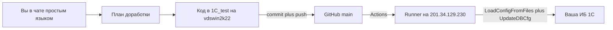

# Plan: Remote 1C deploy (chat → git → Designer)

**Created:** 2026-09-11 17:48
**Orchestration:** orch-2026-09-11-1c-remote-deploy
**Goal:** Daily 1C work like UIS: owner writes in chat in plain Russian → we plan → agent codes on vdswin2k22 (`C:\Users\Administrator\Documents\1С_тест`) → git commit+push → GitHub Actions self-hosted runner on old 1C server `201.34.129.230` loads config into the infobase via Designer (`1cv8t.exe /LoadConfigFromFiles` + `/UpdateDBCfg`). Task is not done until Actions is green.
**Source of truth:** `c:\Users\Administrator\.cursor\plans\remote_1c_deploy_3a596087.plan.md` — do not expand scope.
**Total Tasks:** 9
**Priority:** High
**Status:** 🔄 In Progress

## Scope Boundaries

### In scope
- Probe connectivity from vdswin2k22 to `201.34.129.230` (TCP 22/3389) and this host public IPv4
- SSH alias `1c-erp`, key `1c_erp_ed25519` (never in git), one owner PowerShell paste-block
- Remote `.dev.env` keys + `scripts/1c-remote/` Import/Export using `1cv8t.exe`
- First export of **our** objects/extension into git (not full ERP dump)
- MCP dump mirror + `.cursor/mcp.json` path fix **if SSH works**
- Public repo `https://github.com/ksipia03-dot/1c-lab` + `deploy-1c.yml` on `[self-hosted, windows, 1c-erp]`
- AGENTS.md + always-apply daily loop: commit → push → `gh run list`; do not close before green
- Restore `content/commands` as SSOT calling the same Import
- Docs: `docs/07-sync-github-1c-server.md`, update `quick-start.md` / `cursor-setup.md` (Mac tunnel = legacy)
- Owner handoff texts (IP, Timeweb steps, RDP paste)

### Out of scope (this cycle)
- Phase 2 web client / `INFOBASE_PUBLISH_URL` / opening port 80
- Installing 1C platform on vdswin2k22
- Full ERP dump (~44k files) in git
- Opening SSH 22 to the world
- Ubuntu-rsync deploy (UIS pattern is wording only; 1C deploy is Designer)
- COM / `rsv-data` promises on educational `1cv8t`
- Asking the owner to run `gh auth login` unless a live `gh auth status` check fails

### Secrets / safety
- Do not commit `.dev.env` passwords, SSH private keys, GitHub runner tokens
- Do not put runner token in git or chat
- Do not invent `INFOBASE_PATH` if SSH cannot confirm it

---

## Как будет выглядеть ваш день (цель)

Точно как UIS, только runtime — старый сервер 1С, не Linux VPS.

1. Вы в этом чате пишете простым языком, что нужно в 1С.
2. Мы коротко планируем (что поменять, где в конфигурации).
3. Агент пишет код **здесь**: `C:\Users\Administrator\Documents\1С_тест`.
4. Агент сам делает `git commit` и `git push` (отдельная просьба не нужна).
5. GitHub Actions на **старом** сервере загружает конфигурацию в вашу базу (Конфигуратор, не rsync как у UIS).
6. В чате появляется: запушено, Actions зелёный, база обновлена. Только тогда задача закрыта.

На старом сервере код руками **не правите** — следующий деплой затрёт.



Почему не как UIS один в один: Ubuntu-раннер GitHub **не умеет** 1С. Поэтому робот стоит **на старом Windows** (исходящий интернет к GitHub, порт 22 с всего мира не открываем). Загрузка — `1cv8t DESIGNER /LoadConfigFromFiles` + `/UpdateDBCfg`, см. [`.cursor/rules/getconfigfiles.mdc`](../../.cursor/rules/getconfigfiles.mdc).

---

## Что нужно от вас — один раз, простыми словами

Агент подготовит точные команды и IP. Вам: открыть, скопировать, вставить, написать в чат «готово».

### GitHub на этом компьютере — уже сделано, повторять не нужно

Та же машина `vdswin2k22`, тот же аккаунт `ksipia03-dot`. 8 сентября в UIS закрыли вход: `gh auth` OK, `user.name=ksipia03-dot`, push в `ksipia03-dot/uis` прошёл (`UIS_1.0/history/tasks/2026-09-08-windows-sync-migrate.md`). Кнопка New и `gh auth login` вам больше не нужны.

Репозиторий **публичный** `https://github.com/ksipia03-dot/1c-lab` создаст агент (`gh repo create`). Если при старте `gh auth status` вдруг окажется протухшим — тогда один раз `gh auth login`; пока считаем вход рабочим.

### 1. Файрвол Timeweb (чтобы этот сервер дотянулся до старого)

1. Откройте панель Timeweb → облачный сервер **Brave Smew** (`201.34.129.230`) → файрвол.
2. **Добавить правило** входящее: тип **Своё правило**, протокол **TCP**, порт **22**.
3. Адрес: **не** «для всех». Подсеть = публичный IP **этого** сервера с `/32`. IP напишет агент (одна строка).
4. Сохраните. В чат: «порт 22 открыла».

Подсказка по экрану: [docs/timeweb-firewall-rules.md](../../docs/timeweb-firewall-rules.md).

### 2. Старый сервер: один раз вставить блок в PowerShell

1. Откройте RDP на `201.34.129.230`, как обычно (**plain**, без alternate shell).
2. На старом сервере: **PowerShell от имени администратора**.
3. Вставьте **один готовый блок**, который агент пришлёт в чат после шага 1 (включит OpenSSH и пропишет ключ с этой машины). Ничего не придумывайте сами.
4. В том же окне напишите путь к базе, которую подгрузили, например `C:\1C-Lab\Bases\ERP25_MCP` — или в чат: «база как в .dev.env, ERP25_MCP».
5. В чат: «блок на старом сервере выполнен» + путь к базе.

### 3. Робот выкатки (как Actions у UIS)

1. Откройте GitHub → репозиторий `ksipia03-dot/1c-lab` → **Settings** → **Actions** → **Runners** → **New self-hosted runner**.
2. Операционка: **Windows**.
3. Страница покажет 3 команды. **На старом сервере** в PowerShell вставьте их по очереди (Download, Configure, затем install/run).
4. Имя runner: `1c-erp`. Labels: `self-hosted`, `windows`, `1c-erp`.
5. Поставьте службу, чтобы не зависело от открытого окна (агент даст одну команду `install` после `config`).
6. На GitHub у runner статус **Idle** (зелёный). В чат: «runner Idle».

Токен со страницы GitHub в чат **не копируйте** (секрет). Только статус Idle.

### Что вам больше не нужно делать каждый день

- Не открывать Конфигуратор, чтобы править модули.
- Не копировать файлы на старый сервер руками.
- Не просить отдельно «закоммить» и «задеплой» — это обязанность агента после каждой доработки.

Веб-клиент «потыкать мышкой» — **фаза 2**, после того как git→база уже работает. Сейчас не открываем порт 80 в интернет.

---

## Owner handoff (fill after R1C-001 / R1C-002)

Short owner note file (R1C-009): `ai_docs/develop/plans/2026-09-11-1c-remote-deploy-owner.md`

| Field | Value |
|-------|--------|
| THIS_HOST_PUBLIC_IPV4 | `72.56.105.69` |
| Timeweb subnet | `72.56.105.69/32` |
| Old server | `201.34.129.230` (Brave Smew) |
| FW rule | incoming, type **Своё правило**, TCP **22**, not «для всех» |
| SSH alias | `1c-erp` |
| Key (this host, not git) | `%USERPROFILE%\.ssh\1c_erp_ed25519` |
| RDP paste-block | готов (R1C-002) — один блок ниже; тот же текст в `ai_docs/develop/plans/2026-09-11-1c-remote-deploy-owner.md` |
| Public key fingerprint | `SHA256:czMcyiyhtzHImcthsVznvlkdT+VUFjQy+kdkpsil8Ig` (ed25519, comment `vdswin2k22-1c-erp`) |
| Claimed IB path (verify, do not invent) | `.dev.env` currently has `INFOBASE_PATH=C:\1C-Lab\Bases\ERP25_MCP` — confirm over SSH/owner chat only |
| Claimed platform (verify) | `.dev.env` currently has `PLATFORM_PATH=C:\Program Files (x86)\1cv8t\8.3.27.1688` — use `1cv8t.exe`, not `1cv8.exe` |
| gh auth | OK — Logged in as `ksipia03-dot` (keyring); do not ask owner for `gh auth login` |
| Remaining wait | Owner: Timeweb TCP 22 from `72.56.105.69/32` (if not already) + RDP-paste блока ниже. Smoke SSH 2026-09-11: **blocked-waiting-owner**, error class **hostkey** (not auth, not timeout). |

### RDP paste-block (PowerShell as Administrator on the OLD server)

Скопируйте **целиком**. Ничего не меняйте. Тот же блок: `ai_docs/develop/plans/2026-09-11-1c-remote-deploy-owner.md`.

```powershell
#Requires -RunAsAdministrator
$ErrorActionPreference = 'Stop'
Write-Host '=== 1C-ERP OpenSSH bootstrap (Administrator on 201.34.129.230) ==='

$cap = Get-WindowsCapability -Online | Where-Object { $_.Name -like 'OpenSSH.Server*' } | Select-Object -First 1
if (-not $cap) { throw 'OpenSSH.Server capability not found on this Windows image.' }
if ($cap.State -ne 'Installed') {
    Write-Host "Installing $($cap.Name) ..."
    Add-WindowsCapability -Online -Name $cap.Name | Out-Null
} else {
    Write-Host "OpenSSH.Server already installed ($($cap.Name))."
}

Set-Service -Name sshd -StartupType Automatic
if ((Get-Service -Name sshd).Status -ne 'Running') {
    Start-Service -Name sshd
}

Get-NetFirewallRule -ErrorAction SilentlyContinue |
    Where-Object { $_.Direction -eq 'Inbound' -and ($_.DisplayName -like '*OpenSSH*' -or $_.Name -like '*OpenSSH*') } |
    Enable-NetFirewallRule
if (-not (Get-NetFirewallRule -Name 'OpenSSH-Server-In-TCP-1c-erp' -ErrorAction SilentlyContinue)) {
    New-NetFirewallRule -Name 'OpenSSH-Server-In-TCP-1c-erp' `
        -DisplayName 'OpenSSH SSH Server (sshd) 1c-erp' `
        -Enabled True -Direction Inbound -Protocol TCP -Action Allow -LocalPort 22 -Profile Any | Out-Null
    Write-Host 'Firewall: inbound TCP 22 allow rule created.'
} else {
    Write-Host 'Firewall: inbound TCP 22 allow rule already present.'
}

$pub = 'ssh-ed25519 AAAAC3NzaC1lZDI1NTE5AAAAICQXa4qhJyIrKng4Z2e7iPlpo1aGkumgS9c92nGHTr2n vdswin2k22-1c-erp'
$authKeys = 'C:\ProgramData\ssh\administrators_authorized_keys'
if (-not (Test-Path -LiteralPath 'C:\ProgramData\ssh')) {
    New-Item -ItemType Directory -Path 'C:\ProgramData\ssh' -Force | Out-Null
}
$blob = ''
if (Test-Path -LiteralPath $authKeys) {
    $blob = [System.IO.File]::ReadAllText($authKeys)
}
if ($blob -notlike '*AAAAC3NzaC1lZDI1NTE5AAAAICQXa4qhJyIrKng4Z2e7iPlpo1aGkumgS9c92nGHTr2n*') {
    $prefix = if ([string]::IsNullOrWhiteSpace($blob)) { '' } else { $blob.TrimEnd("`r", "`n") + "`n" }
    $utf8NoBom = New-Object System.Text.UTF8Encoding $false
    [System.IO.File]::WriteAllText($authKeys, ($prefix + $pub + "`n"), $utf8NoBom)
    Write-Host 'Public key written to administrators_authorized_keys.'
} else {
    Write-Host 'Public key already present in administrators_authorized_keys.'
}

& icacls.exe $authKeys /inheritance:r | Out-Null
& icacls.exe $authKeys /grant 'SYSTEM:(F)' | Out-Null
& icacls.exe $authKeys /grant 'BUILTIN\Administrators:(F)' | Out-Null
Write-Host 'icacls: SYSTEM + Administrators, inheritance removed.'
& icacls.exe $authKeys

Restart-Service -Name sshd
Get-Service -Name sshd | Format-List Name, Status, StartType
Write-Host '=== Done. Reply in chat: блок на старом сервере выполнен ==='
```

---

## Tasks

- [x] R1C-001: probe-connectivity (✅ Completed)
- [ ] R1C-002: ssh-bootstrap (blocked-waiting-owner)
- [ ] R1C-003: env-and-scripts (⏳ Pending)
- [ ] R1C-004: dump-and-mcp (⏳ Pending)
- [ ] R1C-005: github-deploy (⏳ Pending)
- [ ] R1C-006: agents-daily-loop (⏳ Pending)
- [ ] R1C-007: restore-commands (⏳ Pending)
- [ ] R1C-008: docs-daily-loop (⏳ Pending)
- [ ] R1C-009: owner-once-handoff (⏳ Pending)

## Dependencies Graph

```
R1C-001
  ├─ R1C-002 ──(live SSH)──► R1C-004 live dump
  ├─ R1C-003 ──────────────► R1C-007
  ├─ R1C-005  (repo+yaml after 001; runner Idle waits owner)
  ├─ R1C-006
  ├─ R1C-008
  └─ R1C-009  (texts after 001; paste when key exists)
```

**First worker task:** R1C-001. Do not start other tasks before it finishes.

### After R1C-001 — start in parallel (no live SSH required)

| ID | Why it can start |
|----|------------------|
| R1C-003 | Scripts and env keys are authored on this host |
| R1C-005 | `gh repo create` + workflow file; runner install is owner-side |
| R1C-006 | AGENTS.md + always-apply rule only |
| R1C-008 | Docs draft; IP from R1C-001; paste filled when ready |
| R1C-009 | Completes when handoff **texts** exist, even if owner has not clicked |

R1C-007 waits for R1C-003 (same Import SSOT). Prefer writing `deploy-1c.yml` after or alongside R1C-003 so the yaml path `scripts/1c-remote/Import-Config.ps1` is stable.

### Wait for owner SSH (R1C-002 smoke)

| ID | What waits |
|----|------------|
| R1C-002 | Smoke `ssh 1c-erp` after owner opens FW + pastes block. If blocked on owner: write paste-block + this-server-IP into this plan and the owner note; mark **blocked-waiting-owner** (not failed). |
| R1C-004 | Live export + MCP dump mirror. If SSH not ready: skip live dump, document the gap, **do not invent IB path**. |
| R1C-005 runner Idle | Owner installs runner; token never in git/chat. Repo+workflow still proceed. |

---

## Progress (updated by orchestrator)

- ✅ R1C-001: probe-connectivity (Completed)
- ⏸ R1C-002: ssh-bootstrap (blocked-waiting-owner)
- 🔄 R1C-003: env-and-scripts (In Progress)
- ⏳ R1C-004: dump-and-mcp (Pending)
- ⏳ R1C-005: github-deploy (Pending)
- ⏳ R1C-006: agents-daily-loop (Pending)
- ⏳ R1C-007: restore-commands (Pending)
- ⏳ R1C-008: docs-daily-loop (Pending)
- ⏳ R1C-009: owner-once-handoff (Pending)

---

## Task Details

### R1C-001: probe-connectivity

- **Priority:** Critical
- **Complexity:** Simple
- **Dependencies:** None — **run first**
- **Estimated time:** 20–40 min
- **Agent:** worker / shell
- **Affects:** this plan Owner handoff table; no application code
- **Probe facts (2026-09-11, leave checkbox 🔄 until reviewer):** see `.cursor/workspace/active/orch-2026-09-11-1c-remote-deploy/r1c-001-probe.md`
  - Public IPv4: `72.56.105.69` (Timeweb `/32`)
  - `gh auth`: OK as `ksipia03-dot`
  - TCP `201.34.129.230`: 22 **open**, 3389 **open**, 5985 filtered/timeout
  - Local `C:\1C-Lab` and `C:\Program Files (x86)\1cv8t`: **absent**
  - SSH hosts: `uis-vps`, `ulya-vps` only; no `1c-erp`; key `1c_erp_ed25519` absent
- **Actions:**
  1. From vdswin2k22 probe TCP **22** and **3389** to `201.34.129.230` (e.g. `Test-NetConnection`).
  2. Get **this** host public IPv4 (e.g. `ifconfig.me` / equivalent) for Timeweb FW `/32`. Write it into the Owner handoff table above.
  3. Run `gh auth status`. Expect Logged in as `ksipia03-dot` (UIS SYNC-005 2026-09-08). Do **not** ask the owner to `gh auth login` unless this live check fails.
  4. List what is visible **without SSH**: port results, existing `%USERPROFILE%\.ssh\config` aliases, whether `1c_erp_ed25519` already exists, whether local 1C platform is absent on vdswin2k22 (do not install it), claimed `.dev.env` path **names** only (never paste passwords into the plan or chat).
- **Acceptance criteria:**
  - TCP 22/3389 results recorded.
  - Public IPv4 of vdswin2k22 written into this plan.
  - `gh auth status` recorded (ok or failed-live).
  - Inventory of “visible without SSH” written into this plan or the owner note.

### R1C-002: ssh-bootstrap

- **Priority:** Critical
- **Complexity:** Moderate
- **Dependencies:** R1C-001
- **Estimated time:** 30–60 min (plus owner wait)
- **Agent:** worker
- **Affects:** `%USERPROFILE%\.ssh\config`, `%USERPROFILE%\.ssh\1c_erp_ed25519` (host-local, never git)
- **Actions:**
  1. Ensure ed25519 key `1c_erp_ed25519` exists on this host; never copy the private key into the repo or chat.
  2. Add SSH alias `1c-erp` in `%USERPROFILE%\.ssh\config` (Host / HostName `201.34.129.230` / IdentityFile). Follow UIS wording style from `UIS_1.0/technical/07-sync-github-vps.md` (alias + config on Windows, not in git).
  3. Prepare **ONE** PowerShell paste-block for the owner to run on the old server (enable OpenSSH, install this host’s **public** key). Put the block into this plan and the owner note.
  4. After owner opens Timeweb FW + pastes the block: smoke `ssh 1c-erp`.
  5. If blocked on owner: write paste-block + this-server-IP into the plan/docs and mark this task **blocked-waiting-owner** (not failed).
- **Acceptance criteria:**
  - Alias `1c-erp` and key name `1c_erp_ed25519` exist on this host; private key not in git.
  - One paste-block is written for the owner.
  - Either smoke SSH succeeds, **or** status is `blocked-waiting-owner` with IP + paste-block recorded.

### R1C-003: env-and-scripts

- **Priority:** High
- **Complexity:** Moderate
- **Dependencies:** R1C-001 (parallel after 001; no live SSH required)
- **Estimated time:** 45–90 min
- **Agent:** worker
- **Affects:**
  - `.dev.env` / `.dev.env.example` (remote keys only; do not commit `.dev.env`)
  - `scripts/1c-remote/Import-Config.ps1`
  - `scripts/1c-remote/Export-Config.ps1`
  - `.cursor/rules/getconfigfiles.mdc` (and `dev-standards-env.mdc` notes if needed: Designer on remote)
- **Actions:**
  1. Add remote keys: `REMOTE_SSH_HOST=1c-erp`. Keep `PLATFORM_PATH` / `INFOBASE_PATH` / `INFOBASE_KIND` as paths **on the old server**. Example file gets empty/placeholder values + comments; live `.dev.env` is not committed (`.gitignore` already has `*.env`).
  2. Write `Import-Config.ps1` — called by agent **and** the runner: `1cv8t.exe DESIGNER /LoadConfigFromFiles` + `/UpdateDBCfg` (extension: `-Extension`). Binary is **`1cv8t.exe`**, not `1cv8.exe`.
  3. Write `Export-Config.ps1` for the first git snapshot of our objects/extension.
  4. Update `getconfigfiles.mdc`: Designer runs on the remote host; local vdswin2k22 has no 1C platform.
- **Acceptance criteria:**
  - Example env documents remote keys; secrets stay out of git.
  - Both scripts exist under `scripts/1c-remote/` and use `1cv8t.exe`.
  - Rule notes that Designer is remote.

### R1C-004: dump-and-mcp

- **Priority:** High
- **Complexity:** Moderate
- **Dependencies:** R1C-001; live dump needs R1C-002 SSH
- **Estimated time:** 45–90 min
- **Agent:** worker
- **Affects:** git-tracked **our** objects/extension only; MCP dump mirror on disk; `.cursor/mcp.json`
- **Actions:**
  1. If SSH works: first export of **our** objects/extension into git (prefer extension). Do **not** commit a full ~44k ERP dump.
  2. If SSH works: mirror dump for MCP onto this host; fix `.cursor/mcp.json` (today it still points at old-host paths `C:\1C-Lab\...`).
  3. If SSH is not ready: skip live dump, document the gap in this plan / docs, **do not invent IB path**.
- **Acceptance criteria:**
  - Either a partial/our-objects export is in git, **or** the SSH gap is documented and no invented IB path was written.
  - Full ERP dump is not in git.
  - `mcp.json` either points at a real local dump path or the gap is documented.

### R1C-005: github-deploy

- **Priority:** Critical
- **Complexity:** Moderate
- **Dependencies:** R1C-001; workflow should call Import from R1C-003
- **Estimated time:** 45–90 min (plus owner runner)
- **Agent:** worker
- **Affects:** git remotes; `.github/workflows/deploy-1c.yml`
- **Actions:**
  1. Confirm `gh auth status`. Then `gh repo create ksipia03-dot/1c-lab --public` + set `origin` (approved: `--source . --remote origin` when appropriate). Do not publish secrets.
  2. Add `.github/workflows/deploy-1c.yml`: `on: push` to `main`; `runs-on: [self-hosted, windows, 1c-erp]`; step runs `scripts/1c-remote/Import-Config.ps1`. IB secrets not in yaml.
  3. Give the owner **paste instructions** to install the Windows self-hosted runner (name `1c-erp`, labels `self-hosted`, `windows`, `1c-erp`, service so it stays Idle). **Do not** put the runner token in git or chat.
  4. A tracked-file task is not closed before `gh run list` shows workflow **Deploy to 1C** green — once the runner exists. Until then, remaining wait is owner Idle.
- **Acceptance criteria:**
  - Public repo `ksipia03-dot/1c-lab` exists and this workspace has `origin`.
  - Workflow file uses the required `runs-on` labels and calls Import-Config.ps1.
  - Owner has runner install steps without a token in git/chat.

### R1C-006: agents-daily-loop

- **Priority:** High
- **Complexity:** Simple
- **Dependencies:** R1C-001 (parallel)
- **Estimated time:** 30–45 min
- **Agent:** worker
- **Affects:** `AGENTS.md`; new always-apply Cursor rule
- **Actions:**
  1. Write `AGENTS.md` in UIS wording style (`UIS_1.0/AGENTS.md`): Windows = source of truth; after every completed tracked change — commit → push → `gh run list`; do not close the task before green deploy. Runtime is Designer on `201.34.129.230`, not rsync/VPS.
  2. Add an **always-apply** rule that restates the same loop (commit + push + green Actions).
- **Acceptance criteria:**
  - `AGENTS.md` exists and states the daily loop.
  - Always-apply rule exists and forbids closing a task before green deploy.

### R1C-007: restore-commands

- **Priority:** High
- **Complexity:** Moderate
- **Dependencies:** R1C-003
- **Estimated time:** 45–75 min
- **Agent:** worker
- **Affects:** `content/commands/getconfigfiles.md`, `content/commands/update1cbase.md`, `content/commands/deploy-and-test.md`
- **Actions:**
  1. Restore those three command files as **SSOT**.
  2. They must call the **same** `scripts/1c-remote/Import-Config.ps1` as Actions (export via Export-Config where relevant).
  3. Do not assume or install local 1C on vdswin2k22.
- **Acceptance criteria:**
  - All three files exist and point at the remote Import (and Export where needed).
  - No instruction to run Designer locally on vdswin2k22.

### R1C-008: docs-daily-loop

- **Priority:** Medium
- **Complexity:** Simple
- **Dependencies:** R1C-001 (parallel)
- **Estimated time:** 30–60 min
- **Agent:** 1c-doc-writer / worker
- **Affects:** `docs/07-sync-github-1c-server.md`, `docs/quick-start.md`, `docs/cursor-setup.md`
- **Actions:**
  1. Write `docs/07-sync-github-1c-server.md` — owner «открой/вставь» checklist + agent sync rule. Mirror UIS meaning from `UIS_1.0/technical/07-sync-github-vps.md`, but deploy is Designer, not rsync.
  2. Update `docs/quick-start.md` and `docs/cursor-setup.md`: Mac tunnel = **legacy**. Daily loop is chat on vdswin2k22 → git → old-server Designer.
  3. Owner checklist in that doc: Timeweb FW, RDP paste, runner Idle.
- **Acceptance criteria:**
  - `docs/07-sync-github-1c-server.md` exists.
  - quick-start and cursor-setup mark Mac tunnel as legacy and describe the new daily loop.

### R1C-009: owner-once-handoff

- **Priority:** Critical
- **Complexity:** Simple
- **Dependencies:** R1C-001; paste-block when R1C-002 key exists
- **Estimated time:** 15–30 min
- **Agent:** worker
- **Affects:** this plan (Owner handoff table); `ai_docs/develop/plans/2026-09-11-1c-remote-deploy-owner.md`
- **Actions:**
  1. After R1C-001, put into **this plan** and a **short owner note**: exact public IP, exact Timeweb steps, ready RDP paste when the key exists.
  2. Completes when those texts exist **even if the owner has not yet clicked**. Remaining wait is reported to the coordinator (not a task failure).
- **Acceptance criteria:**
  - Owner note file exists and is short (IP + Timeweb + RDP paste / “paste when key ready”).
  - Same facts appear in this plan’s Owner handoff table.
  - Coordinator is told what is still waiting on the owner (FW / RDP paste / runner Idle).

---

## Architecture Decisions

- **Source of truth for code:** `C:\Users\Administrator\Documents\1С_тест` on vdswin2k22 (same pattern as UIS Windows tree).
- **Remote runtime:** old Windows 1C host `201.34.129.230`. No 1C platform on this server.
- **Deploy mechanism:** GitHub Actions self-hosted runner → `Import-Config.ps1` → `1cv8t.exe DESIGNER /LoadConfigFromFiles` + `/UpdateDBCfg` (not UIS rsync).
- **SSH:** alias `1c-erp`, key `1c_erp_ed25519`, Timeweb FW TCP 22 from this host `/32` only.
- **Git contents:** our objects / extension only. Full ERP dump stays on disk for MCP, not in git.
- **Commands:** `content/commands/*.md` are SSOT and must call the same Import as Actions.
- **Done means:** `git push` + green Actions run. Phase 2 web client is later.

## Implementation Notes

- Do **not** commit, push, or implement application code in the planning step (already done). Workers implement the nine tasks only.
- Do **not** add a tenth task.
- If `gh auth status` fails live, then and only then ask the owner for `gh auth login`.
- `.dev.env` already claims `PLATFORM_PATH` under `1cv8t` and `INFOBASE_PATH=C:\1C-Lab\Bases\ERP25_MCP` — treat as hints to **verify**, not as invented facts if SSH cannot confirm.
- Current `.cursor/mcp.json` still uses old-host `C:\1C-Lab\...` paths — fix only when a real local dump exists, otherwise document the gap (R1C-004).
- `content/commands/` does not exist yet; restore in R1C-007.
- `scripts/` today has Mac `server-access` leftovers — new scripts go in `scripts/1c-remote/` only.
- UIS wording sources (read, do not copy secrets): `C:\Users\Administrator\Documents\UIS_1.0\AGENTS.md`, `UIS_1.0\technical\07-sync-github-vps.md`.
- Owner Timeweb UI hint: `docs/timeweb-firewall-rules.md` (existing). Do not open 22 to the world.

## Фаза 2 (не блокирует этот цикл, не делать сейчас)

Публикация веб-клиента на старом хосте + `INFOBASE_PUBLISH_URL` через туннель с этой машины. На учебном `1cv8t` не было `webinst` — может понадобиться полная платформа. UI-тесты только по явной просьбе (`UI_TESTING=manual`).
