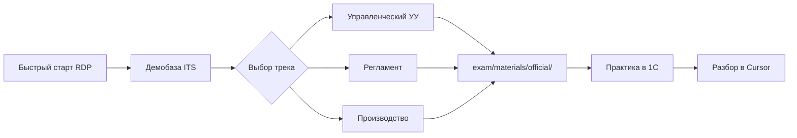

# Треки подготовки к экзаменам 1С:ERP 2.5

Обзор направлений сертификации и специалист-консультанта по **1С:ERP Управление предприятием 2, редакция 2.5**.

Практика выполняется в **1С на сервере** (RDP → «1С:ERP Учебная»). Разбор решений и работа с метаданными — в **Cursor** на Mac (MCP + документация).

**Текущее хранилище билетов и ATT:** [`exam/materials/official/`](../exam/materials/official/) — см. [`SOURCE.md`](../exam/materials/official/SOURCE.md) и [`exam/README.md`](../exam/README.md).  
**Приоритет трека:** **Управленческий учёт (УУ)** — аттестационные файлы `ATT_CK_ERP_UU_*` и билеты с диска уже в `official/`; официальный PDF/EPUB сборника (март 2026) пока **EXAM_BLOCKED** (нужна покупка).

Обновлено: 2026-08-21.

---

## Три основных трека

| Трек | Фокус | Приоритет | Материалы |
|------|-------|-----------|-----------|
| **Управленческий учёт** | Управленческий учёт, бюджетирование, казначейство, продажи/закупки в управленческом контуре | **Текущий** | Локально: [`exam/materials/official/`](../exam/materials/official/) (`ATT_CK_ERP_UU_25_2025_03.doc`, билеты 1–6, «Билет 5…»). Книга: [online.1c.ru](https://online.1c.ru/books/book/36275450/) |
| **Регламентированный учёт** | Бухгалтерский и налоговый учёт, закрытие месяца, отчётность | Вторичный | Локально: `ATT_CK_ERP_RU_24.doc`. Новости: [1c.ru](https://1c.ru/news/info.jsp?id=32788) |
| **Производство / B25** | Планирование и учёт производства, себестоимость, MRP | Вторичный | Локально: `ATT_CK_ERP_B25.doc`. [exam1s.ru производство](https://exam1s.ru/news/19-06-2026-book-1s-spec-cons-erp-25/) |

Дополнительно в `official/`: платформенные материалы (`ATT83PL.rtf`, Actual tickets Platform 8.3) — не заменяют сборник УУ ERP.

---

## Рекомендуемый порядок подготовки



1. Освоить [демобазу ERP 2.5](https://its.1c.ru/db/erp25doc/bookmark/Introduction/DemoBase) на учебной ИБ (после появления `.dt`/`.cf`).
2. **Стартовать с трека УУ** (ближайший фокус стенда).
3. Пройти типовые сценарии из книги / ATT в `exam/materials/official/`.
4. Решать билеты **только из** [`exam/materials/official/`](../exam/materials/official/) — самодельные билеты не создаём.
5. Разбирать ошибки с агентом Cursor (MCP видит метаданные и данные базы).

---

## Где практиковаться

| Действие | Где | Как |
|----------|-----|-----|
| Выполнение билета | Сервер Windows | RDP → **1С:ERP Учебная** |
| Проверка запросов / метаданных | Mac | Cursor + MCP `execute_query` |
| Теория и регламенты | Mac / offline | `docs/1c-erp-25/` (sync с сервера) |
| Билеты / ATT / SOURCE | Workspace + зеркало | `exam/materials/official/` → `C:\1C-Lab\exam\` |

Подробнее: [quick-start.md](quick-start.md).

---

## Документация по темам треков

### Управленческий учёт (приоритет)

- [Бюджетирование](https://its.1c.ru/db/erp25doc/bookmark/Budgeting/Budgeting)
- [Казначейство](https://its.1c.ru/db/erp25doc/bookmark/Treasury/Treasury)
- [Международный финансовый учёт](https://its.1c.ru/db/erp25doc/bookmark/IFRS/IFRS)
- [Продажи](https://its.1c.ru/db/erp25doc/bookmark/Sales/Sales)

### Регламентированный учёт

- [Регламентированный учёт](https://its.1c.ru/db/erp25doc/bookmark/RegulatoryAccounting/RegulatoryAccounting)
- [Настройка параметров учёта](https://its.1c.ru/db/erp25doc/bookmark/InitialSetup/AccountingSettings)

### Производство

- [Производство](https://its.1c.ru/db/erp25doc/bookmark/Production/Production)
- [Склад и доставка](https://its.1c.ru/db/erp25doc/bookmark/Warehouse/Warehouse)

Полный индекс: [1c-erp-25/README.md](1c-erp-25/README.md).

---

## Хранилище билетов (актуально)

**Единственный актуальный каталог билетов/ATT на стенде:**

```
exam/materials/official/     ← текущее хранилище (Downloads inventory + HTML)
  SOURCE.md                  ← provenance, коды изданий, статус PDF/EPUB
  ATT_CK_ERP_UU_*.doc        ← приоритет УУ
  ATT_CK_ERP_RU_*.doc / B25  ← смежные треки
  *.docx / ATT83PL.rtf       ← билеты и платформа
exam/README.md               ← полный индекс файлов
C:\1C-Lab\docs\              ← зеркало docs на сервере
C:\1C-Lab\exam\              ← зеркало exam на сервере
```

Самодельные билеты не создаём. Разбор официальных задач — **по одному**.  
Официальный платный сборник `1C_UU_v_ERP_2026.pdf` / `.epub` — после покупки положить в тот же `exam/materials/official/` и обновить `SOURCE.md`.

---

## Полезные ссылки

| Ресурс | URL |
|--------|-----|
| ИТС ERP 2.5 | https://its.1c.ru/db/erp25doc |
| Экзамены 1С | https://exam1s.ru |
| Официальные новости 1С | https://1c.ru/news/ |
| Книга УУ ERP (март 2026) | https://online.1c.ru/books/book/36275450/ |
